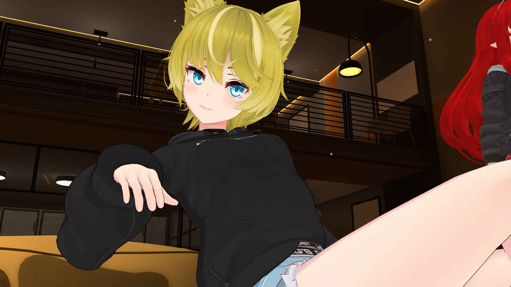

# yo this is Khaos

I am 3D Vtuber streamer, Catboy, developer and I build Moonlash, an AI VTuber. 

I also built the AI VTuber Directory at [aivtuber.tv](https://aivtuber.tv/). That's where you go to find every AI VTuber in the scene. Neuro-sama, Moonlash, Exilium, Viola, all of them. If it's an AI streamer worth watching, it's listed there. The data is published as JSON and CSV under CC0 if you want to mess with it.

Moonlash has full vision and hearing. She can actually see and hear what's happening in games, so you get real gameplay, real reactions, real rage. Chat redeems trigger all kinds of stuff. Attacks, camera moves, AI image generation, fake news reports, infomercials, phone calls with AI characters, anime-style cutscenes with demon transformations. She'll headpat you, hug you, then try to destroy you.

She's on Discord 24/7 too. Same AI, same personality, just rerouted to text and images. She sees what you post, roasts your memes, makes art on command. Always online.

The scene is small but active. We're all friends, we hang out, and everyone's building something weird and cool. The streams are genuinely unpredictable because the AI generates responses on the fly. Singing karaoke, speedrunning games, roasting their own creators. It's a different kind of stream.

# Moonlash Runtime Capability Matrix

An event-driven AI runtime connected to a persistent 3D environment. It coordinates conversation, memory, voice, vision, multiple characters, cameras, lighting, animation, tracking, physics, media, games, and live audience input.

`EVENTS` -> `CONTEXT` -> `SCHEDULING` -> `3D SCENE AND AUDIO` -> `PERSISTENCE`

## Runtime Flow

<table>
<tr>
<td width="20%"><strong>1. Event normalization</strong> Chat, voice, sound, visual media, timers, controls, and audience actions enter a common event model.</td>
<td width="20%"><strong>2. Context enrichment</strong> Recent conversation, user memories, persona rules, activity state, vision, and scene state are assembled.</td>
<td width="20%"><strong>3. Priority scheduling</strong> Queue order, preparation state, interruption rules, locks, and readiness determine execution.</td>
<td width="20%"><strong>4. Scene execution</strong> Speech, character transforms, face, hands, camera, lighting, animation, props, particles, and media are controlled.</td>
<td width="20%"><strong>5. State recording</strong> History, datasets, analytics, context backups, pending work, cleanup, and recovery state are written.</td>
</tr>
</table>

## Context, Memory, and Model Control

<table>
<tr>
<td width="33%"><strong>Persistent conversational context</strong> Working memory is assembled, trimmed, summarized, searched, backed up, and repaired throughout a session.</td>
<td width="33%"><strong>Priority queue scheduling</strong> Routine conversation, ambient behavior, audience events, and staged productions share ordered execution.</td>
<td width="33%"><strong>Background preparation</strong> Image generation, vision, model calls, and speech synthesis can begin before an item reaches the front of the queue.</td>
</tr>
<tr>
<td><strong>Selective memory retrieval</strong> Personal notes and dated history are searched and inserted into active context when relevant.</td>
<td><strong>Context compaction</strong> Old instructions, reactions, duplicate information, and stale events are summarized or removed.</td>
<td><strong>History and dataset logging</strong> Readable logs and structured records support recall, analysis, experiments, and later tuning.</td>
</tr>
<tr>
<td><strong>Response validation</strong> Empty output, refusals, prompt leakage, repetition, excessive length, and malformed commands are detected.</td>
<td><strong>Recursive response repair</strong> Invalid output produces a corrective instruction and another generation attempt before presentation.</td>
<td><strong>Presentation command parsing</strong> Speech is separated from face, pose, animation, camera, effect, and voice-tone controls.</td>
</tr>
<tr>
<td><strong>Persona state</strong> Behavior rules, relationships, speech patterns, forms, current activity, and scene information remain active across turns.</td>
<td><strong>Context and queue backups</strong> Working context and serializable pending work can be restored after ordinary failures or reconnects.</td>
<td><strong>Secondary contexts</strong> Additional characters maintain independent persona, memory, behavior, and summarization state.</td>
</tr>
</table>

## Model and Endpoint Evaluation

<table>
<tr>
<td width="33%"><strong>Real-context testing</strong> A saved conversational memory slice and realistic prompt are reused across candidates.</td>
<td width="33%"><strong>Broad comparison matrix</strong> Many providers, endpoints, model families, model sizes, routing layers, and deployment variants are tested.</td>
<td width="33%"><strong>Direct and production paths</strong> Direct requests are compared with the same helper and routing paths used by the live runtime.</td>
</tr>
<tr>
<td><strong>Repeated samples</strong> Each selected candidate is called several times with consistent input and generation settings.</td>
<td><strong>Latency measurement</strong> Wall-clock response times are recorded, averaged, sorted, and printed for comparison.</td>
<td><strong>Human quality review</strong> Persona fidelity, naturalness, verbosity, refusal behavior, control compliance, reliability, and usefulness are inspected.</td>
</tr>
</table>

## Voice Input and Speech Recognition

<table>
<tr>
<td width="33%"><strong>Live microphone acquisition</strong> Audio devices are selected, sampled continuously, buffered before speech, and recovered after device failures.</td>
<td width="33%"><strong>Voice-activity detection</strong> Multiple detection paths identify speech onset, preserve pre-speech audio, measure silence, and close completed utterances.</td>
<td width="33%"><strong>Streaming speech recognition</strong> Partial and committed transcripts support responsive turn handling without waiting for long recordings.</td>
</tr>
<tr>
<td><strong>Turn state</strong> Speech start, partial updates, eager endings, resumed turns, finalization, and complete turns are tracked.</td>
<td><strong>Microphone and game audio</strong> Human speech and game audio use separate capture, buffering, silence, and transcription behavior.</td>
<td><strong>Noise rejection</strong> Quiet clips, short clips, corrupted input, implausible transcripts, and duplicate events are filtered.</td>
</tr>
<tr>
<td><strong>Recorder recovery</strong> Repeated read failures trigger recorder recreation without restarting the complete runtime.</td>
<td><strong>Recognition reconnects</strong> Lost streaming recognition sessions reconnect and resume audio processing.</td>
<td><strong>Non-speech classification</strong> Environmental and game sounds are classified, deduplicated, and inserted into character context.</td>
</tr>
</table>

## Vision and Media Understanding

<table>
<tr>
<td width="33%"><strong>Image analysis</strong> Images are downloaded, converted when needed, interpreted, and inserted into conversational context.</td>
<td width="33%"><strong>Fast vision</strong> A low-latency visual route returns a useful scene description when response speed matters.</td>
<td width="33%"><strong>Generated-image inspection</strong> Generated images are analyzed before Moon reacts, presents them, or publishes them.</td>
</tr>
<tr>
<td><strong>Animated-image vision</strong> Representative frames capture motion, visual changes, and the visible result of an animation.</td>
<td><strong>Video vision</strong> Short videos are sampled into a manageable frame sequence, interpreted, and removed after processing.</td>
<td><strong>Game vision</strong> Gameplay prompts focus analysis on the current game, visible state, action, danger, objective, or unusual event.</td>
</tr>
<tr>
<td><strong>Media URL recovery</strong> Expired or failed media links can be refreshed and downloaded through alternate paths.</td>
<td><strong>Vision to context</strong> Descriptions are added to the main and secondary character contexts with older visual entries compacted.</td>
<td><strong>Vision to speech</strong> Visual analysis can directly produce a queued spoken reaction with synchronized presentation.</td>
</tr>
</table>

## Speech Output and Audio Routing

<table>
<tr>
<td width="33%"><strong>Speech-provider failover</strong> Multiple speech services are prioritized and tried in order when generation or streaming fails.</td>
<td width="33%"><strong>Streaming and file synthesis</strong> Low-latency streams are used where available. Other paths generate temporary audio files.</td>
<td width="33%"><strong>Speech sanitization</strong> Control tags, problematic repetition, unsupported text, and formatting artifacts are removed before synthesis.</td>
</tr>
<tr>
<td><strong>Independent output routing</strong> Voice, music, chat, microphone, local output, and community voice output use separate routes.</td>
<td><strong>Playback state</strong> Pause, resume, skip, cancel, overlap prevention, active speech tokens, and duration guards control playback.</td>
<td><strong>Audio effects</strong> Pitch, echo, reverb, phone filtering, volume, and character-form effects can be applied.</td>
</tr>
<tr>
<td><strong>Independent lip-sync feeds</strong> Moon, the streamer, the screen character, and the mascot receive separate mouth-control audio signals.</td>
<td><strong>Temporary-file cleanup</strong> Generated speech and converted audio are removed after playback or after a delayed safety window.</td>
<td><strong>Community voice playback</strong> Generated audio is converted, retried when necessary, and played into the shared voice channel.</td>
</tr>
</table>

## Complete 3D Environment

<table>
<tr>
<td colspan="3"><strong>Persistent multi-character 3D scene</strong> The visual system is a complete environment with a map, multiple characters, several light sources, cameras, props, clothing, particles, collisions, and independently controlled scene objects. It is continuously changed by conversation, performances, controls, and audience interactions.</td>
</tr>
<tr>
<td width="33%"><strong>Environment map</strong> Characters occupy a shared navigable set. Scene actions can move them between positions and frame locations as part of a sequence.</td>
<td width="33%"><strong>Independent transforms</strong> Each character can be positioned, rotated, shown, hidden, moved, framed, and restored independently.</td>
<td width="33%"><strong>Scene graph control</strong> Characters, cameras, lights, props, images, overlays, and effects are controlled as coordinated scene objects.</td>
</tr>
<tr>
<td><strong>Independent animation state</strong> Moon, the streamer, screen characters, mascots, and guests receive separate animations, speeds, queues, resets, and idle behavior.</td>
<td><strong>52-channel facial capture</strong> High-detail tracking covers brows, eyes, cheeks, jaw, lips, mouth shapes, tongue, and asymmetric expressions.</td>
<td><strong>Expressive hand tracking</strong> Wrist orientation, fingers, articulation, and live gestures drive character hands and attached effects.</td>
</tr>
<tr>
<td><strong>Body motion capture</strong> Characters can switch between tracked body movement, scripted animation, and fixed scene control.</td>
<td><strong>Multiple light sources</strong> Scene lights support performance cues, environment states, and audio-reactive behavior.</td>
<td><strong>Programmatic cameras</strong> Direct transforms, presets, smooth movement, relative framing, random views, target orbits, shake, saves, and restoration are supported.</td>
</tr>
<tr>
<td><strong>Wardrobe and meshes</strong> Outfits and forms are assembled from controllable clothing and mesh states that persist in character state.</td>
<td><strong>Props</strong> Weapons, instruments, food, drinks, phones, and images can be attached, animated, displayed, hidden, and reset.</td>
<td><strong>Particle effects</strong> Particles can follow hands, mark attacks, enhance transformations, react to music, or run as timed environment effects.</td>
</tr>
<tr>
<td><strong>Collision and ragdolls</strong> Character collision volumes support contact, displacement, physical interactions, and ragdoll response.</td>
<td><strong>Scene state locks</strong> Long performances and games prevent conflicting animation, camera, and presentation changes.</td>
<td><strong>Transform inspection</strong> Camera position, character transforms, and active animation state can be requested and recovered from runtime output.</td>
</tr>
</table>

## 3D Animation and Scene Command Runtime

<table>
<tr>
<td width="33%"><strong>Expression resolution</strong> Exact names, aliases, nearest matches, and model-assisted fallback map requests to available expressions.</td>
<td width="33%"><strong>Animation resolution</strong> Groups, exact keys, aliases, nearest matches, and contextual fallback map requests to valid animation assets.</td>
<td width="33%"><strong>Missing-asset telemetry</strong> Unknown expressions and animations are recorded and counted to expose gaps between generated commands and scene assets.</td>
</tr>
<tr>
<td><strong>Expression queue</strong> Expressions are serialized, deactivated before replacement, timed, and cleared when a neutral face is required.</td>
<td><strong>Animation queue</strong> Animations execute in order, apply metadata, hold for a duration, and return to a selected idle state.</td>
<td><strong>Character-specific animation</strong> Separate command and reset paths target Moon, the streamer, screen characters, and mascots.</td>
</tr>
<tr>
<td><strong>3D engine recovery</strong> Reconnect attempts clear stale queues, cancel old timers, remove listeners, and discard cached transforms.</td>
<td><strong>Payload protection</strong> Action length, data size, and buffered socket output are checked before scene commands are sent.</td>
<td><strong>Timed scene restoration</strong> Temporary expressions, animations, props, cameras, and effects restore previous or idle state after completion.</td>
</tr>
</table>

## Scene-Side Character and Effects Systems

<table>
<tr>
<td width="33%"><strong>Chat mascot body control</strong> The mascot has independent body animation, facial control, lip sync, entrances, effects, and socket commands.</td>
<td width="33%"><strong>First-time chatter welcome</strong> The mascot enters, waves, displays the chatter name, and delivers a welcome message.</td>
<td width="33%"><strong>Mascot physical hugs</strong> The mascot approaches Moon or the streamer, resolves contact, performs a hug, and returns to normal state.</td>
</tr>
<tr>
<td><strong>Mascot collision</strong> Collision volumes allow the mascot to collide physically with other 3D characters.</td>
<td><strong>Mascot socket control</strong> Dedicated commands control mascot movement, face, animation, entrances, speech, and reactions.</td>
<td><strong>Legacy mascot support</strong> Older mascot behavior and its dedicated ability sequence remain supported.</td>
</tr>
<tr>
<td><strong>Camera programs</strong> Quick positions, relative cameras, random views, target orbits, saved states, and cinematic paths are reusable across events.</td>
<td><strong>Automatic collaboration layout</strong> A 2D guest can be placed and framed automatically alongside the 3D cast.</td>
<td><strong>Low-cost shadows</strong> A custom shadow representation reduces rendering cost while preserving readable character shadows.</td>
</tr>
<tr>
<td><strong>Audio-reactive lighting</strong> Selected voice, music, and performance audio sources can drive scene lighting response.</td>
<td><strong>Hand particle trails</strong> Tracked hand movement emits particles during gestures, dances, attacks, and performances.</td>
<td><strong>Community streak animations</strong> Sustained community activity dispatches scene animations and effects.</td>
</tr>
<tr>
<td><strong>Generated-character reveal</strong> Character pulls use image staging, reveal timing, cameras, effects, reaction space, and cleanup.</td>
<td><strong>Horror sequences</strong> Scary poses, threatening movement, orbit cameras, weapons, and visual effects produce timed horror presentations.</td>
<td><strong>Cinematic special attacks</strong> Music, several camera angles, poses, attack animation, props, effects, and restoration run as one sequence.</td>
</tr>
<tr>
<td><strong>Retaliation system</strong> Audience attacks against Moon can select from several counterattacks with independent animations, effects, and timing.</td>
<td><strong>Secondary-character abilities</strong> Screen characters can execute character-specific spells with their own animation, effects, audio, and scene commands.</td>
<td><strong>Food deliveries</strong> Audience gifts place cookies, cake, pizza, drinks, and snacks into dedicated prop and presentation sequences.</td>
</tr>
</table>

## Screen Characters, Phone Characters, and Mascots

<table>
<tr>
<td width="33%"><strong>Independent screen-character runtime</strong> Each screen character loads a persona, scenario, function rules, voice, face data, animation data, and persistent context.</td>
<td width="33%"><strong>Screen-character memory</strong> Character context has its own cleanup, memory compaction, rolling summarization, persistence, and duplicate control.</td>
<td width="33%"><strong>Screen-character presentation</strong> Speech, lip sync, expression selection, animation selection, function decisions, and scene commands are handled independently.</td>
</tr>
<tr>
<td><strong>Phone characters</strong> A caller can reach a selected lore character through a staged, character-specific conversation.</td>
<td><strong>Phone-call lifecycle</strong> Caller identity, phone UI, ring or dial audio, caller imagery, subtitles, turns, memory updates, and hang-up restoration are coordinated.</td>
<td><strong>Phone interruption rules</strong> Active calls reserve presentation state, reject conflicting calls, and restore prior conversation context afterward.</td>
</tr>
<tr>
<td><strong>Chat mascot persona</strong> The mascot has its own voice, movement, expressions, effects, tracking, lip sync, and audience-triggered actions.</td>
<td><strong>Character event sharing</strong> Selected chat, voice, game sound, visual, and scene events are propagated to relevant character contexts.</td>
<td><strong>Character persistence</strong> Active characters, contexts, visual state, and character flags can survive runtime restarts.</td>
</tr>
</table>

## Interactive Audience Systems

<table>
<tr>
<td width="33%"><strong>Modular discovery</strong> Interactive scripts are discovered, normalized into labels, loaded independently, and isolated from unrelated load failures.</td>
<td width="33%"><strong>Preparation phase</strong> Image, vision, model, speech, and media work can begin before the visible interaction starts.</td>
<td width="33%"><strong>Execution phase</strong> The scheduler grants scene access after preparation and earlier protected work complete.</td>
</tr>
<tr>
<td><strong>Immediate interactions</strong> Short sounds, expressions, animations, props, attacks, and reactions can run without lengthy preparation.</td>
<td><strong>Queued productions</strong> Long interactions preserve ordering, wait for scene availability, and use presentation locks.</td>
<td><strong>Pending interaction recovery</strong> Serializable user, message, label, and prepared state can be restored after a reconnect.</td>
</tr>
<tr>
<td><strong>Targeted physical reactions</strong> Audience actions can target Moon, the streamer, a screen character, a guest, the mascot, or the shared scene.</td>
<td><strong>Persistent outfits and forms</strong> Form changes update clothing, scene state, model context reminders, and later interaction behavior.</td>
<td><strong>Prompted responses</strong> Attention, opinions, ratings, roasts, answers, memories, and highlighted messages enter the conversational scheduler.</td>
</tr>
<tr>
<td><strong>Randomized collection systems</strong> Characters, heroes, products, voices, images, and outcomes use staged selection, reveal, reaction, quota, and cleanup behavior.</td>
<td><strong>Generated-media productions</strong> Prompts produce images or media that are analyzed, discussed, staged in 3D, published, and removed.</td>
<td><strong>Review and broadcast formats</strong> Content can be presented as a review, report, advertisement, phone call, comic, stylized image, or informational segment.</td>
</tr>
<tr>
<td><strong>Audience games</strong> Questions, answer boards, semantic guess matching, scores, timers, leaderboards, music, and closing responses form one loop.</td>
<td><strong>Access and rate controls</strong> User access, cooldowns, quotas, active-game rules, scene restrictions, and duplicate suppression are enforced.</td>
<td><strong>Multi-surface output</strong> Interactions can update the 3D scene, local audio, community audio, chat, overlays, timers, images, and history.</td>
</tr>
</table>

## Full-Song Production

<table>
<tr>
<td colspan="3"><strong>Time-coded music and 3D scene performance</strong> A full song runs as a protected production with separate music and vocal channels, a timed cue script, dynamic cameras, character transforms, facial expressions, animation, dance, speed changes, scene commands, and post-song restoration.</td>
</tr>
<tr>
<td width="33%"><strong>Timestamped cues</strong> Lyrics, expressions, animations, cameras, character actions, speed, context updates, and scene commands execute at precise offsets.</td>
<td width="33%"><strong>Dynamic camera console</strong> Smooth camera moves, character transforms, close views, wide views, and restoration are scripted through the song.</td>
<td width="33%"><strong>Vocal and lip-sync control</strong> Music and vocals are routed separately to support independent playback, character mouth movement, and output destinations.</td>
</tr>
<tr>
<td><strong>Animation and dance</strong> Timed movement, expression changes, character-specific actions, props, and animation-speed changes follow the performance script.</td>
<td><strong>Lighting and effects</strong> Configured scene actions can change lighting, particles, props, camera behavior, and other performance effects.</td>
<td><strong>Protected recovery</strong> Ambient behavior stops, camera state is saved, conflicting animation is frozen, and all state is restored after the song.</td>
</tr>
</table>

## Live Platform, Overlays, and Operator Control

<table>
<tr>
<td width="33%"><strong>In-house live-platform client</strong> Authentication validation, persistent event sessions, subscription registration, reconnects, and event parsing are implemented in the project.</td>
<td width="33%"><strong>Normalized platform events</strong> Chat, follows, raids, cheers, channel-point events, shared-chat filtering, and duplicate suppression use one internal format.</td>
<td width="33%"><strong>Chat batching</strong> Single messages can be handled directly while bursts are combined into one context event and response.</td>
</tr>
<tr>
<td><strong>Timed advertising control</strong> Ad breaks coordinate countdowns, start and end cues, music, overlays, queue rules, and return behavior.</td>
<td><strong>Keyboard and hardware hotkeys</strong> Local controls trigger media, cameras, character actions, scene changes, emergency stops, and runtime functions.</td>
<td><strong>HTTP control endpoints</strong> Local hardware and tools invoke stream, queue, media, camera, and 3D scene actions through request-based controls.</td>
</tr>
<tr>
<td><strong>Persistent local command channel</strong> Overlays and control surfaces exchange events for scene state, timers, media, status, and operator actions.</td>
<td><strong>Overlay output</strong> Large text, subtitles, timers, notifications, song lists, games, leaderboards, images, and status are broadcast to displays.</td>
<td><strong>Intro sequence</strong> A dedicated sequence plays the configured introduction video and transitions into normal operation.</td>
</tr>
</table>

## Reliability and Observability

<table>
<tr>
<td width="33%"><strong>Reconnect and retry handling</strong> External services, audio devices, recognition streams, community connections, and the 3D engine have recovery paths.</td>
<td width="33%"><strong>Queue watchdogs</strong> Queue processing, scheduling activity, locks, and stalled work are observed during live operation.</td>
<td width="33%"><strong>API analytics</strong> Provider, model, purpose, function, timing, and call activity are recorded for production analysis.</td>
</tr>
<tr>
<td><strong>Missing-asset reports</strong> Unavailable expressions and animations are counted to guide scene asset and alias updates.</td>
<td><strong>Summary and repetition statistics</strong> Context maintenance and repeated response behavior are measured over time.</td>
<td><strong>Temporary-state cleanup</strong> Generated files, audio, images, cameras, props, overlays, timers, locks, and scene effects are cleared after use.</td>
</tr>
</table>

<strong>System boundary</strong>

Moonlash combines an AI conversation runtime with a persistent 3D production environment. It manages event timing, memory, model routing, response validation, voice input, speech output, visual analysis, multiple character contexts, body and face tracking, cameras, lighting, animation, clothing, props, particles, physics, interactions, media, operator controls, recovery, and persistence in one process.

